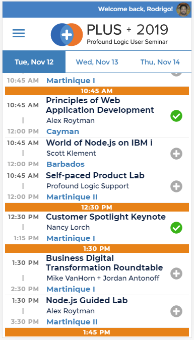
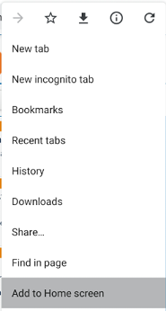
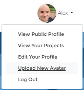
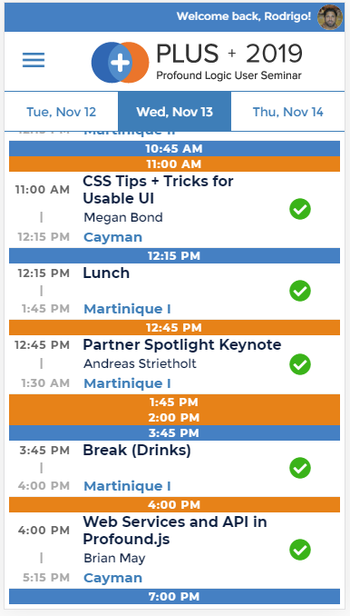
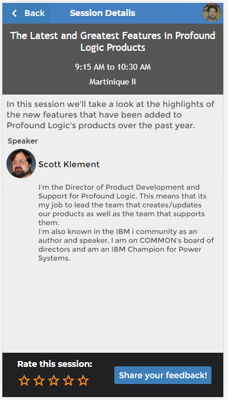

# PLUS 2019 Conference Scheduling App

Use this browser-based Mobile App to view and customize your PLUS 2019 schedule. Follow the steps below to get started.

## Add PLUS 2019 to your Mobile Home Screen

Navigate your mobile browser to https://noderun.com/run/profound-logic/plus2019.

Then, find the *Add to Home* option in your browser.

## Edit your Profile Photo

To edit your profile photo, visit https://noderun.com. Once logged in, select the *Upload New Avatar* menu option.

## Edit your Display Name and Bio

In the app, tap the hamburger menu to Edit your Display Name and Bio.

## Plan your Schedule

Tap the plus sign to the right of the session you want to attend to add it to your schedule. A green checkmark will appear.

You can select *My Schedule* from the hamburger menu to see only the sessions you have selected.

## Rate Sessions and Leave Feedback

Tap any session to see session details. From the *Session Details* screen, you can rate the session or submit feedback.

